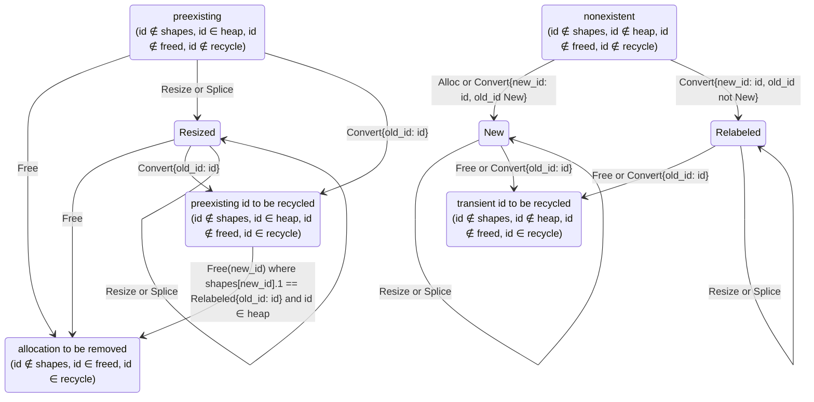

# Journal and Flushing — Design Iteration 3

To optimize write performance, mutations to a `Kladde<T>` don't directly mutate the corresponding bytes in the kladde file.
They are instead recorded as a sequence of operations (*ops*) in a special allocation of the kladde file called the *journal*.
Whenever the journal reaches a threshold size it is *flushed*: the recorded operations get optimized to a minimal set of writes, these writes are applied to the on-file representation of the stored data in a crash-resistent way, and the journal is discarded.

The journal is an *optimization*, not a mechanism for atomicity (that's the job of [[../kladde-docs/content/spec/transactions-and-batches|transactions]]).
The journal is therefore mostly invisible to authors of application code or data type implementations — semantically, every mutation that an app performs is persisted as soon as its corresponding transaction (= single op or framed sequence of ops) is completely recorded in the journal.
Even if the application crashes, the next time kladde opens the file it will apply the journal before reading any data, so the application can't distinguish between mutations that have already been applied to the data and mutations whose ops are still queued in the journal, so both are considered persisted.
The only places where the journal is observable are:

- a small contribution to the file size *while the file is open* (upon closing, the journal will be flushed and a best-effort compaction is performed to reclaim its space);
- increased overall throughput of mutations at the cost of occasional small latency spikes for flushing (in normal settings a few KiB of I/O + 2 `fsync` calls per flush);
- while kladde gives the journal precedence over any stale data and therefore never hands out stale overwritten data, forensic tools may be able to recover outdated data before the journal is flushed (this is a somewhat pedantic since closing the file ordinarily will flush the journal, and since stale data can prevail in kladde files anyway due to fragmentation unless [[privacy-cleanups]] are performed); and
- while the journal is guaranteed to survive an application crash, it is not guaranteed to survive a power outage: a power outage may reset a file to its state after the last flush (which is never in the middle of a transaction). Lifting this limitation would make mutations orders of magnitude slower.
  A power outage additionally carries a narrower risk to *content*, because the unit of writeback is the page rather than the byte range that was written, so bytes that were never modified can be damaged as passengers in a page that was in flight.
  kladde's guarantee is therefore [[#durability-guarantees|tiered]]: the file's structure always survives and it always opens, and torn content is **detected and reported** rather than silently returned.

## Guiding principles
### Goals and non-goals

The journal is an optimization that makes persistence of many small edits cheaper, especially for storage on a device where sequential access is cheaper than random access.
It is tied to a flushing mechanism that applies the journal to the rest of the kladde file and then releases the journal.
The journal is *not* an undo buffer, and flushing is *not* a mechanism for atomicity. In detail,

- Every transaction (and every op outside of a transaction) is considered committed as soon as it is fully recorded to the journal.
  Flushing only changes how the effect of these transactions is represented internally in the kladde file (as actions or as their resulting state), not whether they have occurred.
- Atomicity is enforced at the level of transactions, not at the level of the journal.
  Since transactions are typically relatively small in kladde, the journal typically accumulates many transactions, which are flushed all at once when the journal is flushed.
  A crash during flushing doesn't affect which transactions will be recovered — the effects of all transactions will be recovered when kladde re-opens the file.
- Since all transactions are already considered committed once they hit the journal, flushing may ignore transaction boundaries and reorder, merge, or optimize out ops over the entire journal, not just within each transaction.
  This is beneficial in typical editor applications where mutations typically happen in bursts at nearby locations, sometimes even overwriting each other.
  Flushing only has to apply the net result of these burst edits.

### Resulting requirements

The above goals impose the following requirements:

- Appending to the journal should only involve sequential writes (no random access writes) and, more importantly, no `fsync`.
  Calling `fsync` for every transaction would introduce an unreasonable performance overhead since transactions are typically relatively small in kladde.
- Writing to the journal must be crash tolerant.
  When the application crashes mid journal-write, kladde must be able to recover the state before the last transaction was written to the journal.
- Flushing must be crash tolerant.
  When the application crashes mid flushing, kladde must be able to finish flushing when it reopens the file even if flushing reordered operations.
- Flushing should minimize the amount of disk operations (reads and writes) and linearize them where possible.
  Compute and memory access is much cheaper than disk operations, so we'd rather spend more time preparing an efficient plan for flushing than executing an inefficient one.
- The journal should not impose too much overhead (regarding both disk space and I/O operations) even if transactions are relatively short and thus plenty.
  At the same time, some overhead per transaction is unavoidable, which is why the design of `kladde-persist` should encourage bundling multiple ops into a single transaction.
  However, it should also not steer application authors into making exorbitantly large transactions since those would require the journal to grow very large (aiming at a middle ground of not too short but also not too large transactions is what motivated [[batches]]).
- Correctness is paramount, which is why invariants should be clearly stated in this document, and for every introduced complexity, its benefits must be weighted off against the risk of bugs.

## The journal

The journal is an append-only sequence of *transactions*, where each transaction consists of a single or multiple operations (*ops*).
Every transaction that is fully recorded in the journal is considered committed, i.e., its state change is persisted in the file and will survive an application crash.
A subsequent flushing operation does not promote the "level of persistence" (except that its `fsync` barriers make the effects durable against a power outage, subject to the [[#durability-guarantees|tiering]] below).

### Transactions and ordering discipline

Mutations are recorded to the journal in units of transactions, where each transaction wraps a sequence of ops.
Journaling operates only on a flattened list of transactions — [[../kladde-docs/content/spec/transactions-and-batches|batches and nested transactions]] are higher-level user-facing concepts that the backend translates to a flat sequence of transactions where every op is part of exactly one transaction (including free-standing ops, which the backend wraps in individual single-op transactions).

Kladde guarantees two properties for transactions:

- **Atomicity**: every transaction is either persisted completely or not at all, even if the application crashes or the device suffers a power outage (in the latter case subject to the [[#durability-guarantees|content tiering]] — a transaction is never *partly* recorded, but a power outage can damage bytes elsewhere in a page a flush was writing).
- **Immediate persistence:** *as soon as a transaction is fully recorded in the journal*, it is considered persisted to the file and will survive an application crash (but not necessarily a power outage, which may reset the file to an empty journal or a prefix of the journal up until any transaction boundary, and which carries the separate content risk covered in [[#durability-guarantees]]).

The immediate persistence property imposes an **ordering discipline** on authors of application code and type implementations, which the atomicity property allows them to break temporarily:

> **Every transaction must transform a valid state to a valid state** (*within* transactions, invalid intermediate state is allowed).

Here, what exactly "valid state" means is up to the application author.
The point is, if the app crashes while it performs a sequence of transactions, the next time kladde loads the file it will recover the state from after the last completed transaction (note that [[../kladde-docs/content/spec/transactions-and-batches|batches and nested transactions]] are resolved at the time ops reach the journal, so if an application uses these then the last transaction boundary in the journal may lie further in the past than the last innermost nested transaction boundary).

Since recording a transaction to the journal makes it immediately persistent, transaction boundaries cease to be meaningful from the point the transaction has been fully recorded to the journal, and they only become relevant again if the application crashes and kladde has to recover the last transaction boundary.
Thus, *flushing is oblivious to transactions*.
Flushing may (and does) reorder, combine, and annihilate ops across transactions as long as this leaves the resulting state invariant since flushing only changes *how* the current state is represented in the file, not *what* the state is (and since the entire flushing operation is crash-resistent in itself, see below).
Note that the order of recorded ops still matters, even within transactions: writing data to some allocation and then copying some content of that allocation to a different allocation copies the data that was just written, while recording the same two ops in reverse order copies the old data and then overwrites it only in the source allocation, leading to a different final state.
This holds regardless of whether the two operations are part of the same or different transactions.
Atomicity does not erase order of operations, it only guarantees that intermediate state is never materialized.

### Journal operations (ops)

The vocabulary of ops that can be recorded in the journal is deliberately **type-agnostic**.
Ops express byte-level mutations of allocations and changes to the shapes and existence of allocations, not application-level operations.
There is no "push an element into a `PersistableVec`" op and no "insert a (key, value) pair into a `PersistableHashMap`" op — the type implementations map these to (transactions containing) one or more of the multiple of the low-level ops below.
This type agnostic op vocabulary is a real trade: it means replay never dispatches on an application type, never needs a type registry, and never has to call back into a container implementation, which in turn is what makes a kladde file readable by generic tools (e.g., a future kladde file inspector or compactor) even if they don't know all opaque data types used in the file.
What the type agnostic op vocabulary gives up is the ability to collapse operations that cancel only at the semantic level bot not on the level of memory allocations (e.g., rope operations that change the shape of the rope but are semantically a no-op).

The following ops are defined:

| Opcode | Operation and payload                                                                                                                                            | Effect                                                                                                             |
| ------ | ---------------------------------------------------------------------------------------------------------------------------------------------------------------- | ------------------------------------------------------------------------------------------------------------------ |
| 0      | `Alloc(id, size)`                                                                                                                                                | brings a memory allocation with `id`, `size` (and sizedness inferrable from `id`) into existence                   |
| 1      | `Free(id)`                                                                                                                                                       | releases the memory allocation with `id` (queuing `id` for recycling after the flush)                              |
| 2      | `Resize(id, new_size)`                                                                                                                                           | changes `id`'s size, preserving `min(old, new)` bytes and appending `max(0, new-old)` bytes of uninitialized data. |
| 3      | `Convert{old_id, new_id, new_size}` (struct variant with named fields to avoid confusion between `old_id` and `new_id`)                                          | `Resize` with additional changes of sizedness, minting `new_id` and queuing `old_id` for recycling after the flush |
| 4      | `Write(id, offset, bytes)`                                                                                                                                       | overwrites `bytes.len()` bytes at `offset` within `id`                                                             |
| 5      | `Splice(id, offset, old_len, bytes)`                                                                                                                             | replaces `old_len` bytes at `offset` with `bytes`, shifting the tail and resizing                                  |
| 6      | `Copy{src, src_offset, len, dst, dst_offset}` (struct variant with named fields to avoid confusion between `src_*` and `dst_*`, and between `len` and `_offset`) | copies a byte range between (or within) allocations, overwriting at the destination                                |
`Copy` is the only op that makes one allocation's content depend on another's.
`Splice` reads existing content too, but only its own allocation's tail, and the fold resolves that read symbolically rather than by touching the file.
Both matter to folding, which is where those reads become `Storage` pieces, and to hoisting, which is where `Storage` pieces that collide with a destination get copied out.

**Normalisation the backend owes the journal.**
Three degenerate forms are excluded at the point ops are recorded, so neither the fold nor recovery has to carry a case for them:

- `Write`/`Splice`/`Copy` with a zero-length payload or `len` are dropped (a `Splice` with `old_len > 0` and `bytes.len() == 0` is *not* degenerate — it is a deletion).
- `Alloc` with `size == 0` is rejected. The heap keys allocations by address and assumes a positive extent, so a zero-sized allocation has no well-defined place (see `later.md`).
- `Resize`/`Convert` to the same size and sizedness are dropped, since they fold to nothing anyway.

### On-storage representation

Although the journal is not implemented as a `Persistable` type, it has a similar structure as most `Persistable` types: it has an in-memory and an on-storage representation, where the on-storage representation is authoritative and the in-memory representation optimizes read access but can be fully derived from the on-storage representation.

The on-storage representation of the journal sits inside a regular allocation of the kladde file that is tracked by the heap like any other allocation.
It contains a header, a sequence of serialized and framed transactions, and an optional tail with arbitrary bytes (potentially left over from a previous use of the address region).

```
journal      := header transaction* tail:byte*  ; tail is ignored; it may be any data left over from before the last flush
header       := salt (wal_pointer | 0x00{12})   ; wal_pointer points to write-ahead log when it exists (see section "Hoisting"), else all 0.
salt         := byte{4}                         ; e.g., CRC of previous journal ++ its wal_pointer ++ its write-ahead log (not normative)
wal_pointer  := address:byte{8} crc             ; address is little-endian; CRC is over `salt`, all `ops` in the journal, and `address`
transaction  := (op | multiple_ops), crc        ; CRC is cumulative over `salt` and all `op`s to this point (but not `wal_pointer`), see below
op           := opcode:byte payload:byte*       ; payload length and format is determined by opcode, see below
multiple_ops := (count_tag:varint, op{count})   ; count_tag = count + 5 (where count > 1; count_tag >= 7 avoids clashes with single op)
crc          := byte{4}                         ; 4-byte checksum
```

The on-storage representation is designed to be compact but complete.
It only needs to be read from disk when recovering from a crash; normal flushing operations consult its mirror in the in-memory representation instead, see below.
The `payload` of ops is serialized as the concatenation of the parameters listed in the column "Operation and payload" in the above table of ops, in the stated order, where all integers (including pointers ids) are encoded as varint and `bytes` is encoded as a varint `len` followed by `len` bytes.

The CRCs in combination with the `salt` buy crash resistance: after a crash, kladde can recover the end of the last fully recorded transaction by reading until either the end of the allocation or until a wrong CRC is reached and then back-tracking to the last correct CRC (see [[#recovery]]).
Since the `salt` changes after every flush, any stale data in the journal allocation that contains previously valid transactions from a previous journal have become invalid as soon as that previous journal was flushed.

### In-memory representation

The in-memory representation of the journal maintains the data structures:

- `committed: &[u8]` — a mirror of the ops that are committed to the on-storage representation of the journal, without the journal header (salt) and the transaction framing (`count_tag` and `crc`); thus `ops := op* = (opcode:byte payload:byte*)*`;  a mirror of the on-storage representation.
  See [transactions and Batches](../kladde-docs/content/spec/transactions-and-batches) for an explanation how the backend maintains `committed` as a prefix of a buffer `ops: Vec<u8>` that grows any time a transaction is committed.
  The salt and transaction framing are stripped from `committed` because their only purpose is to make the *process of writing a transaction to the file* transactional.
  Including them in them in the in-memory representation would complicate parsing `committed` unnecessarily.
  Keeping `committed` in its serialized form rather than as a `Vec<Op>` is what makes a `Literal` a plain offset into it, and it avoids one heap allocation per op.
  The fold still wants an `Op` enum to match on, but it can borrow: `Op<'a>` holding `&'a [u8]` for payloads, produced by an iterator over `committed`, keeps the parse allocation-free.
  This also has to hold for recovery, which reconstructs `committed` from the file — `Literal` offsets are only meaningful if the framing-stripped layout is byte-identical, which is an unstated coupling worth testing (see § *Risks*).
- `pending: HashMap<Pointer, Option<Size>>` — a *state snapshot* of any allocation whose geometry has changed since the last flush.
  `Some(size)` records a new size; `None` is a **tombstone** marking an allocation that has been freed but whose `Free` has not yet been applied to the heap.
  Unordered, last-writer-wins.
  Updated whenever operations are appended to `ops` (not `committed`), and repopulated after flushing from whatever ops remain past `committed_cursor` (see below).
  It is used by the backend to resolve size and liveness queries — any entry in `pending` has precedence over the heap.
- There is no analog to `pending` for the *contents* of changed allocations — kladde never serves any content from the file to application code or data type implementations while `ops` is non-empty.

**Why tombstones rather than simply deleting the entry.**
A `Free(id)` that is recorded in `ops` but not yet flushed leaves the heap's `id → address` entry intact, so without a tombstone `resolve` would fall through to the heap and report the allocation as live at its old address and size — the *pre-flush truth*, which by then disagrees with the logical state.
The tombstone costs one discriminant per touched allocation and nothing in the common path, and it buys three things: `resolve`/`size` are correct rather than merely documented as approximate; a **double free** is caught where it happens rather than at the next flush, where the fold would hit `Free` on an id it has already released; and live-allocation counts and any future leak checker keep working while a journal is outstanding, which is most of the time.

**Invariant: an id's counter returns to the pool only at flush**, after the corresponding `Free` has been applied to the heap.
Within one journal, every id therefore names at most one allocation.

This has to be stated because the natural implementation of `Free` recycles the counter at once, and that would be a soundness bug: the journal and every structure derived from it are keyed by id, so

```
Alloc(id, 8)      # id minted
Write(id, 0, …)
Free(id)          # if the counter were returned to the pool here …
Alloc(id, 16)     # … the same counter could be handed out again — same id!
Write(id, 0, …)
```

would put two allocation lifetimes under one key, and the fold could not tell them apart: it cannot emit two claims for one key, and the first `Write` would be attributed to the second allocation.
The id pool therefore defers its free-list pushes to the cleanup step, where "recycle every id with a tombstone" is exactly the action to take — so the tombstones and the invariant implement each other.

## Flushing

Flushing can be triggered either manually or by the mechanisms described in [transactions and batches](../kladde-docs/content/spec/transactions-and-batches).
Conceptually, flushing consists of the following steps (a concrete implementation may find it easier to perform some of them jointly).

1. **Folding:** iterate over `committed` to create a representation of the state transition from the state at the beginning of `committed` to the state at the end of `committed`, expressed on the level of *allocations* on the destination side, but already lowered to *addresses* on the source side.
   Auto-annihilates any intermediate state (e.g., bytes that were written but then overwritten again or whose allocation got freed afterwards; allocations ids that were claimed and then freed; allocations that were resized multiple times; ...).
   Only states *what* the transition is, not *how* to achieve it.
2. **Placement:** apply `shapes` to the heap (in a favorable order, see discussion) to decide where each new allocation (and each resized allocation if it needs to be relocated) goes.
   Record all addresses that changed in an `id --> address` map `placements`.
3. **Compaction** (optional): run a certain budget of incremental compaction steps, apply them to the heap and to `placements`, and apply them to `pieces`.
   It has to run **before** destination lowering, since lowering needs final addresses and compaction is what makes them final; running it afterwards would mean lowering twice.
   That does not cost anything in cost estimation, though — the two indexes a step's cost is measured against need only *addresses*, which placement has already produced, so they can be built at the end of step 2 and maintained incrementally as steps are accepted.
4. **Destination lowering:** resolve *destination* `(id, offset)` pairs in `pieces` (i.e., the keys of `pieces`) with their addresses by querying the heap state *after* placement.
   Remove any no-op pieces where source and destination address equal (which occur, e.g., in resizes or relabels that didn't lead to relocation)
5. **Hoisting:** create a write-ahead log.
   Initialize it with a serialization of `placements`.
   Then iterate over `pieces` in destination order, detect all subregions that are both read from and written to, split them off into explicit regions and mark them as being hoisted.
   Copy out all source bytes of hoisted regions and append them to the write-ahead log.
   Append a salted CRC to the write-ahead log and link to the write-ahead log from the journal.
   `fsync`.
6. **Execution:** iterate again over `pieces` and apply the changes to the file, reading the data either from the corresponding source locations or from the write-ahead log created during hoisting.
   Then invalidate the journal (overwrite the salt with the CRC of `concatenate(salt, committed)`, which is also the CRC of the last committed transaction) and `fsync`.
   This step is idempotent due to hoisting.
7. **Cleanup:** reclaim any space used by the write-ahead log and adjust the size of the journal allocation if necessary.
   Reset all in-memory data structures as described in [transactions and batches](../kladde-docs/content/spec/transactions-and-batches)

### Step 1: Folding

Folding walks `committed` once, in order, parsing ops as it goes.
It produces a complete description of the state transition without deciding anything about how to realize it.
Folding does not mutate `heap` (this is deferred to *placement*).

**Output:** folding produces

- the **fate and lineage** of each `id` affected by the `committed` ops: does the allocation labeled by `id` and/or the `id` itself survive the fold and, if yes, what is the final size of the allocation and does the `id` label a fresh, pre-existing, or relabeled allocation?
- a **piece table** for all allocations that survive the fold and whose content may be affected: where does each of its bytes in the final state come from?

#### Fate and lineage (`shapes`, `freed`, and `recycle`)

Three variables: `shapes`, `freed`, and `recycle`.

```rust
/// Final allocation size and a hint about the id's origin (will be used by placement),
shapes: HashMap<Id, (Size, Lineage)>

/// The set of every allocation that was freed (not just relabeled).
freed: Vec<Id>

/// superset of `freed` containing all ids that can be re-minted once the flush is done (`freed` + pre-existing
/// ids that were retired by `Relabel` + ids whose allocations were never materialized in the file because they
/// existed only temporarily during the fold).
recycle: Vec<Id>

enum Lineage {
	New,                // Allocated since last flush, possibly resized later, but not yet freed or relabeled.
	Resized,            // Preexisting before the fold, got resized, and not yet freed or relabeled.
	Relabeled(old_id),  // `old_id` was present before the fold, got relabeled (possibly transitively) and possibly resized, and not yet freed.
	// If id ∉ shapes then (a) it was freed or relabeled in the fold (and is now in `recycle`) or
	// (b) its existence, size, and label were not changed in `committed`.
}
```

**State transitions:**
The state of each `id` is defined by the tuple `(shapes[id], id ∈ freed, id ∈ recycle, id ∈ heap)`.
The ops `Alloc`, `Free`, `Resize`, `Splice`, and `Convert` each induce a transition between valid states, where `Convert` induces two transitions (one for `old_id` and one for `new_id`).
Since folding doesn't mutate `heap`, the state transition diagram separates into two connected components, one for `id ∈ heap` and one for `id ∉ heap`, with the respective initial states "preexisting" and "nonexisting" for every `id` at the beginning of the fold.
At the beginning of the fold, `shapes`, `freed`, and `recycle` are initialized empty, and any `id` not in `shapes` or `recycle` is implicitly in its respective starting state ("preexisting" if `id  ∈ heap`, "nonexistent" otherwise).
Once an `id` leaves its starting state, it cannot return to a starting state until the flush (ids are never recycled within an active journal).
Note that the state "allocation to be removed" can only be reached by `id`s that start in the "preexisting" state — `id`s that start as "nonexistent" don't have an allocation in the pre-flush file that could be removed.



In detail, the following transitions exist:

| Op                                                                                         | `shapes[id].1` before op                                       | Description                                                                                                                                            | `shapes[id]` after op                                                | Effects on `freed` and `recycle`                    |
| ------------------------------------------------------------------------------------------ | -------------------------------------------------------------- | ------------------------------------------------------------------------------------------------------------------------------------------------------ | -------------------------------------------------------------------- | --------------------------------------------------- |
| `Alloc(id, size)`                                                                          | no entry                                                       | New allocation                                                                                                                                         | `(size, New)`                                                        | none                                                |
| `Free(id)`                                                                                 | `Resized` or (`id ∉ shapes`)                                   | A pre-existing allocation is freed.                                                                                                                    | doesn't exist                                                        | add `id` to `freed` and `recycled`                  |
|                                                                                            | `New` or `Relabeled{old_id ∉ heap}`                            | A transient allocation is freed.                                                                                                                       | doesn't exist                                                        | add `id` to `recycle`                               |
|                                                                                            | `Relabeled{old_id ∈ heap}`                                     | A pre-existing but since relabeled allocation is freed under its new name.                                                                             | doesn't exist                                                        | add `old_id` to `freed` (it's already in `recycle`) |
| `Resize(id, new_size)` or `Splice(id, offset, old_len, bytes)` with `old_len != bytes.len` | no entry                                                       | A pre-existing allocation is resized for the first time (either explicitly or by splicing, in which case `new_size = old_size - old_len + bytes.len`). | `(new_size, Resized)`                                                | none                                                |
|                                                                                            | `Resized`                                                      | A pre-existing allocation is resized again.                                                                                                            | `(new_size, Resized)`                                                | none                                                |
|                                                                                            | `New`                                                          | A new allocation is resized.                                                                                                                           | `(new_size, New)`                                                    | none                                                |
|                                                                                            | `Relabeled(old_id)`                                            | A relabeled allocation is resized.                                                                                                                     | `(new_size, Relabeled(old_id))`                                      | none                                                |
| `Convert(old_id, new_id, new_size)`                                                        | `old_id`: no entry or `Resized`;<br>`new_id`: must not exist   | A pre-existing allocation `old_id` is relabeled to `new_id` and resized.                                                                               | `old_id`: no entry;<br>`new_id`: `(new_size, Relabeled(old_id))`     | add `old_id` to `recycle`                           |
|                                                                                            | `old_id`: `New`;<br>`new_id`: must not exist                   | A transient allocation is relabeled for the first time and resized.                                                                                    | `old_id`: no entry;<br>`new_id`: `(new_size, New)`                   | same as above                                       |
|                                                                                            | `old_id`: `Relabeled(old_old_id)`;<br>`new_id`: must not exist | A transient allocation is relabeled again and resized.                                                                                                 | `old_id`: no entry;<br>`new_id`: `(new_size, Relabeled(old_old_id))` | same as above                                       |
#### Content (`pieces`)

The piece table (`pieces`) records all changes to the byte content of allocations.

```rust
pieces: BTreeMap<(Id, Offset), Piece>, // `Offset` is the heap's `Size` type used as an offset

enum Piece {
    Literal(Size),     // an offset into `committed`, naming payload bytes of a Write/Splice op
    Storage(Address),  // the *pre-flush* content of another (or the same) allocation
    Undefined,         // uninitialized; may legally hold anything
}
```

Each entry in `pieces` defines the content of a range of offsets `[begin, end)` within an allocation `id`, where `(id, begin)` is the key of the entry, and `end` is the smallest offset `end > begin` for which an entry with key `(id, end)` exists in `pieces` (or the current size of the allocation if no such entry exists).

**Invariants for `pieces` upheld by folding:**

1. `pieces` only contains keys `(id, offset)` where
	- `id` labels a currently live allocation (i.e., `id ∈ shapes` inclusive-or (`id ∈ heap` and `id ∉ recycle`)); and
	- `offset < size(id)` where `size(id) = shapes[id].0` if it exists or else the size of `id` on `heap`.
2. **A range with no covering entry means *unchanged*.**
   `pieces` is a sparse overlay, not a total description: an allocation may legitimately have no entry at all, and one that has entries may be silent on a prefix.
   Silence resolves through `base(id)` — `Undefined` for a `New` id, and the pre-flush bytes at the id's own (or, for `Relabeled(old_id)`, at `old_id`'s) address otherwise.
   In particular `(id, 0) ∈ pieces` is **not** an invariant, and `Alloc` inserts nothing.
3. Consequently, an allocation that **relocates** needs its silence made explicit, or the fold's output would not describe the byte movement.
   That is not folding's job, because whether a reshape relocates is a placement decision: step 2 inserts `(id, 0) → Storage(old_address)` for exactly the reshapes that turn out to relocate, and step 3 does the same for allocations that compaction moves.
4. If `id` is not live (`id ∈ recycle` or (`id ∉ heap` and `id ∉ shapes`)) then no `(id, _) ∈ pieces`.
5. Every `Storage(src_address)` piece references the source content of the file *as it was before the flush began* — never a value that this flush is going to produce.
   This holds because `Copy` and `Splice` take *pieces from the source's current table*, not bytes.
   By the time the fold reaches op *n*, the source's table already reflects ops 1…*n*−1, so the copy inherits their resolution rather than referring to them.
   It is worth being explicit about this because almost everything downstream depends on it: it is why the plan can be reordered at all and why hoisting (if needed) can read the file directly rather than having to interleave with execution.
6. Every `Storage(src_address)` piece names a range of source addresses in the file where each address in that range was inside an allocation before the flush began (in practice, the range almost always lies entirely inside a single allocation, but in rare cases, fusion of two neighboring `Storage` may coincidentally result in a single `Storage` whose source range crosses allocation boundaries).

**Content resolution:**
Let `content[id][offset]` be the byte at `offset` in allocation `id` at a given point during the fold.
Its value is defined implicitly by looking up the entry with key `(id, dst_offset)` in `pieces` with largest `dst_offset <= offset`.

- If no matching entry exists in `pieces`: assuming the query is valid (`id` is live, i.e., on `heap` and not in `recycle`, and `offset` is within bounds), it queries the content of a preexisting allocation that has not been changed in either size or content since the last flush.
  Thus, `content[id][offset]` is the byte at `offset` in allocation `id` as it is currently written in the file.
- If a matching entry `(id, dst_offset)` with `dst_offset <= offset` exists in `pieces` then, assuming `offset < current_size(id)`:
	- If it is `Literal(src_offset)` then `content[id][offset] == committed[src_offset + (offset - dst_offset)]`.
	- If it is `Storage(src_address)` then `content[id][offset]` is the byte in the backing storage at address `src_address + (offset - dst_offset)`
	- If it is `Undefined` then no assumptions about `content[id][offset]` may be made (the *placement* step may even place it past the end of the file).

Note that `Literal` is an optimization.
We could technically resolve it to `Storage` pointing to the place where the literal is written in the journal, but `Literal`s express the additional guarantee that they are conflict free (and can thus be ignored during hoisting below).
Further, lowering `Literal`s to `Storage`s would require awkward calculations to take transaction frames into account, and reading literals from the file during the execution step when they are already in memory.

**Piece table primitives.**
All folding rules are expressed in terms of four operations, so that the boundary and materialisation cases are handled once rather than once per op.
`base(id)` denotes the source that describes an allocation's content wherever the table says nothing about it, and is determined by lineage:

| lineage of `id` | `base(id)` at offset `k` |
| --- | --- |
| `New` | `Undefined` |
| `Resized`, or `id ∉ shapes` (pre-existing and untouched) | `Storage(heap.resolve(id) + k)` |
| `Relabeled(old_id)` | `Storage(heap.resolve(old_id) + k)` |

The `Relabeled` row is the reason `Lineage` carries `old_id` at all: `new_id` has no pre-flush address, so the only way to name its bytes is through the id it replaced.

- **`advance(piece, k)`** — the same source shifted `k` bytes forward: `Literal(o) → Literal(o + k)`, `Storage(a) → Storage(a + k)`, `Undefined → Undefined`.
- **`split(id, offset)`** — ensure a key exists at `(id, offset)`, so a range boundary can be cut there.
  If an entry covers `offset` at key `(id, b)` with `b < offset`, insert `(id, offset) → advance(value, offset − b)`.
  If *nothing* covers `offset`, the covering source is `base(id)` conceptually anchored at 0, so insert `(id, offset) → advance(base(id), offset)`.
  A split at `offset == 0` or `offset == size(id)` is a no-op.
- **`read(id, offset, len) → Vec<(rel, Piece)>`** — the pieces covering `[offset, offset + len)`, rebased so the first has `rel == 0`.
  Resolves through `base(id)` where the table is silent, exactly as `split` does, but without mutating the table.
- **`write(id, offset, len, pieces)`** — replace `[offset, offset + len)`:
  `split(id, offset)`, `split(id, offset + len)`, remove all keys strictly inside, insert `pieces` rebased to `offset`, then **fuse** at both boundaries.
- **`shift_tail(id, from, delta)`** — re-key every entry `(id, k ≥ from)` to `(id, k + delta)`, in an order that avoids collisions (descending for `delta > 0`, ascending for `delta < 0`).

**Fusion** drops the boundary between adjacent entries `(id, a) → P` and `(id, b) → Q` whenever `advance(P, b − a) == Q`.
This is what keeps the table small: a run of sequential `Write`s whose payloads happen to be adjacent in `committed` collapses to one `Literal`, two adjacent `Undefined`s always collapse, and two `Storage`s collapse when their addresses are contiguous (which is why invariant 6 admits a `Storage` range that crosses an allocation boundary).
Fusing after every `write` keeps the table in a canonical form, so no separate compaction pass over it is needed.

**Folding rules:**

| Op | Effect on `pieces` |
| --- | --- |
| `Alloc(id, size)` | nothing. The table stays silent and `base(id) == Undefined` covers it; invariant 3 is stated accordingly. |
| `Free(id)` | remove all `(id, _)` |
| `Resize(id, new_size)` | if shrinking: `split(id, new_size)` and remove all `(id, ≥ new_size)`.<br>If growing: `split(id, old_size)` — which materialises `base(id)` for the prefix if the table was silent — then `write(id, old_size, new_size − old_size, [(0, Undefined)])`. |
| `Convert{old_id, new_id, new_size}` | apply the `Resize` rule to `old_id` with `new_size`, then re-key every `(old_id, k)` to `(new_id, k)` with values unchanged. **The values are not rewritten**: a `Storage(a)` piece names a pre-flush *address*, which the relabel does not move, and `new_id` has no pre-flush address for it to name. |
| `Write(id, offset, bytes)` | `write(id, offset, bytes.len(), [(0, Literal(p))])`, where `p` is the offset of `bytes` within `committed`. |
| `Splice(id, offset, old_len, bytes)` | let `delta = bytes.len() − old_len` (signed).<br>If `delta ≠ 0`: `shift_tail(id, offset + old_len, delta)` — this moves the tail and effects the size change in one step, so no `Undefined` region ever appears.<br>Then `write(id, offset, bytes.len(), [(0, Literal(p))])` if `bytes` is non-empty; for an empty `bytes` the shift alone is the whole effect. |
| `Copy{src, src_offset, len, dst, dst_offset}` | `write(dst, dst_offset, len, read(src, src_offset, len))`.<br>Taking *pieces* rather than bytes is what upholds invariant 5 and what makes a copy out of a transient allocation resolve to the original sources. |

Two things are worth noticing in that table because they are the whole reason the rules are this short.

**`Alloc` inserts nothing.**
An earlier draft inserted `(id, 0) → Undefined`, which is correct but redundant: `base(id)` already yields `Undefined` for a `New` id, so the explicit entry only duplicates it, and it forces a special case for `size == 0`.
Leaving the table silent means a freshly allocated allocation that is then fully overwritten ends up with exactly one entry, which is the common shape.

**`Resize` and `Convert` no longer insert a placeholder `Storage(address[id])` at offset 0.**
The earlier form did that so a *relocating* reshape would have something to move, but at fold time it is not yet known whether the reshape relocates — that is a placement decision — and inserting the placeholder unconditionally means every in-place resize produces a table entry that step 4 then has to recognise as a no-op and drop.
`split` materialises `base(id)` on demand, so the same effect is achieved lazily, and the *relocating* case is handled where the decision is actually made: step 2 inserts `(id, 0) → Storage(old_address)` for exactly those reshapes that turn out to relocate.

#### Emergent properties of folding

Four things fall out without being coded as special cases, and they are most of why folding is worth doing:

- **Repeated writes to the same range emit one write**, because the table holds exactly one source per byte by construction.
- **An allocation created and freed within one journal (aka transient allocation) never touches storage at all**, and a `Copy` out of it resolves to the original sources rather than forcing the transient allocation to be materialized.
- **An identity piece emits nothing.** `(id, offset) → Storage(src_address)` with `src_address` equal to the the address of `id` after placement + `offset` means the bytes are already where they belong; without this check every untouched region of every persistent allocation would be copied onto itself.
- **A `Convert` that does not relocate emits nothing**, because a relabel keeps the address, so every piece that was identity before is still identity after; this is worth a test.

**The fold does not describe the same point in time as `pending`.**
The fold describes the transition ending at `committed_cursor`; `pending` describes the state at `ops.len()`.
Under the flush-trigger policy in [transactions and batches](../kladde-docs/content/spec/transactions-and-batches), those two points **do not** coincide in general: a flush can be triggered while a completed transaction is still sitting in `ops` past `committed_cursor`, precisely so that the transaction can be written into an empty journal afterwards.
Two consequences:

- `pending` must be **repopulated** from the remaining ops after a flush, not cleared.
- The fold's output must **not** be compared against `pending` as a consistency check.

### Step 2: Placement

Decide where each new segment that survived the fold goes and whether each resizing / relabeling requires requires relocation, and resolve those relocations by running the geometry changes against the `heap` in an order that allows for best possible placement.
This step doesn't move any data yet, it only moves the in-memory representation of the `heap` from the pre-`committed` to the post-`committed` state, updating which ids the `heap` considers to be live and which address ranges they will be mapped to.

Iterate over `shapes` and split it into the following:

```rust
/// Initialized from all `New` entries in `shapes`.
claims: Vec<Claim>

/// Initialized empty, used for hoisting.
non_derivable_claims: HashSet<id>
/// Initialized empty, used for hoisting.
claimed_addresses: HashMap<id, Address>

/// Sorted by decreasing `old_address`.
reshapes: Vec<Reshape>

struct Claim {
	id: Id,
	size: Size,
	kind: ClaimKind
}

enum ClaimKind {
	New,
	RelocatingGrow,
	RelocatingShrink,
	RelocatingRelabel,
}

struct Reshape {
	id: Id,
	old_address: Address,
	new_size: Size,
	kind: ReshapeKind
}

enum ReshapeKind {
	Resize,
	Relabel(old_id)
}

// One type throughout: `Id == H::Id == Pointer<W>`, the same id the journal ops carry.
// Sizedness is a bit inside the pointer (`Pointer::from_parts`), not a separate type, so
// there is no fixed/resizable distinction to thread through here -- `id.is_fixed_size()`
// answers it wherever placement needs to know. `Address` and `Size` are `H::Address` and
// `H::Size`, i.e. `u64` and `u32` for `GainGreedyHeap`.
```

Thus, iterate over `shapes` (consuming it) and, for each entry:

- If it is `id → New(size)`: insert `Claim { size, id, kind: New }` into `claims`.
- If it is `id → Resized(new_size)`: insert `Reshape { id, old_address: heap.resolve(id), new_size, kind: Resize }` into `reshapes`
- If it is `id → Relabel(old_id, new_size)`: insert `Reshape { id, old_address: heap.resolve(old_id), new_size, kind: Relabel(old_id) }` into `reshapes`

Then run the following operations against the `heap`, in this order.
The ordering principle is **release space before consuming it**, so that every claim sees the largest free ranges that this flush will ever offer.

1. **Frees:** iterate over `freed` (consuming it) in arbitrary order and call `heap.free(id)` for every `id`.
	- Note: this could be done during folding instead, in which case `freed` disappears and only its superset `recycle` remains.
	  Doing it here keeps folding free of heap mutation, which is what lets folding be a pure function of `committed` — worth preserving, since it is also what makes folding cheap to test.
2. **Relabels:** for each `Reshape` with `kind == Relabel(old_id)`, in any order, call `heap.relabel(old_id, id)`.
   This is a pure rekey — same address, same size — but it is *not* a no-op for placement: sizedness lives in the id, and `GainGreedyHeap` keys its evacuation index on it, so the allocation must already carry its final id before step 3 decides where it goes.
   Doing all relabels up front also means step 3 never has to reason about a half-applied conversion.
3. **In-place reshapes:** iterate over `reshapes` (consuming it) in order of **decreasing `old_address`**.
   For each entry, call a (to be added) `heap.resize_in_place(id, new_size) -> bool` that performs the resize only if it can keep the address, and otherwise frees the old extent and returns `false`.
   Descending order is what makes this pay: a shrink high in the file releases the range immediately below its old end, which is exactly where the *next* entry — at a lower address — may want to grow into.
   Ascending order would consume that space before it was released.

   Doing the free inside the method rather than making the caller call `heap.free` afterwards is worth it only if it lets the implementation reuse a cursor it has already descended to; otherwise the simpler signature is better.

   For each entry that could not be done in place:
    - append a corresponding `Claim` so step 4 completes it;
    - add `id` to `non_derivable_claims` (see below); and
    - if `(id, 0)` does not exist in `pieces`, insert `(id, 0) → Storage(old_address)`, which is what turns the fold's *silence* about an unchanged allocation into an explicit byte movement.
4. **Claims in first-fit-decreasing (FFD) order, mostly:** sort `claims` by `RelocatingShrink` last, then by decreasing `size`, then fixed-size ids first.
   Iterate over it (consuming it) and call `heap.alloc` for each entry.
   Record every resulting address in `claimed_addresses`, regardless of kind.

**Which claims are non-derivable, and why the distinction exists.**
`claimed_addresses` is serialised into the WAL as a bare sequence of addresses sorted by id (§ *On-storage representation of the WAL*), so recovery has to reconstruct *which* ids those addresses belong to.
It can do that for free only where the **fold alone** determines that an id will be claimed — which is exactly the `New` ids, since a fresh allocation always needs a place.
Every other claim exists because of a decision made *after* the fold:

| claim | derivable from the fold? |
| --- | --- |
| `New` | **yes** — folding says the id is new, so it must be claimed |
| `RelocatingGrow`, `RelocatingShrink`, `RelocatingRelabel` | **no** — whether the reshape kept its address is a step-3 decision |
| moved by compaction (step 3 below) | **no** — a step-4 decision |

So `non_derivable_claims` is *all claimed ids except the `New` ones*, and step 3 above adds every reshape that failed to stay in place.
An earlier formulation treated `RelocatingRelabel` as derivable; it is not — a relabel keeps its address in the common case and relocates only when the new sizedness or size does not fit, and nothing in `committed` says which happened.

### Step 3: Compaction

Run a few incremental compaction steps on the heap.
For each step, check if `(id, 0)` exists in `pieces` for every allocation that the compaction step moves (note: at this point, it might be easier if compaction returns `(id, old_address, new_address)` instead of `(old_address, len, new address)` if that is easily possible).

- For any moved allocation where `(id, 0)` does not exist in `pieces`, add `(id, 0) → Storage(old_address)`.
- For any moved allocations where `(id, 0)` exists in `pieces`: nothing has to be done explicitly; any `Storage` entries that were no-ops now automatically become workload.

Also add `id` to `claimed_addresses` and `non_derivable_claims` where appropriate:

- For any moved allocation where `id ∈ claimed_addresses`: update `claimed_addresses[id]` with the new address;
  don't insert into `non_derivable_claims` — the fact that the `id` is already in `claimed_addresses` tells us that its claim is either derivable or has already been recorded to be non-derivable.
- For any moved allocation where `id ∉ claimed_addresses`: insert into `claimed_addresses` with the new address *and* into `non_derivable_claims`.

When finding the best compaction step subject to a given budget, the heap internally estimates the cost of compaction steps by the size of the moved allocation, which is probably fine.
But on the caller side, we might want to use a more accurate estimate of the cost:
- the actual size of the moved bytes in the allocation (full size if `id` was not in the piece table, otherwise only the number of pre-move no-ops for `id` in the piece table); plus
- the write-ahead amount that the move adds, which is computable in `O(log n + k)` per candidate — see below.

**Computing a step's WAL cost.**
Your instinct is right: the two indexes hoisting needs (§ *Conflict detection*) are exactly the two this query needs, so build them **before** compaction and maintain them incrementally as steps are accepted.

- `W` — post-flush destination ranges, disjoint, sorted.
- `R` — source ranges of `Storage` pieces, sorted (not necessarily disjoint).

A candidate step moving allocation `id` of length `L` from `A` to `B` adds, at most, three overlaps:

| overlap | meaning |
| --- | --- |
| `[B, B+L) ∩ R` | bytes some other piece reads that this move would now overwrite |
| `[A, A+L) ∩ W` | bytes this move reads that some other piece overwrites |
| `[A, A+L) ∩ [B, B+L)` | the move overlaps itself — a *slide* |

Each is a binary search plus an output-sensitive scan, and their total length is the extra WAL the step costs.
Accepting a step then updates both indexes: `[B, B+L)` replaces the allocation's old destination range in `W`, and `[A, A+L)` joins `R` if the allocation had no `Storage` piece yet.

This makes the evacuation/slide asymmetry quantitative rather than folklore.
An **evacuation** writes into space that was free before the flush, so `[B, B+L) ∩ R = ∅` by construction and its only possible cost is the second row.
A **slide** always hits the third row, and a slide of `L` bytes by `d` overlaps itself in `L − d` bytes — so a small shift over a long run puts nearly the whole run into the WAL, which is the concrete reason to prefer evacuations at flush time and to budget compaction by *WAL bytes added* rather than by bytes moved.

**One easily-missed detail about `old_address`.**
In the rule above, `old_address` is the address the allocation had *immediately before this compaction step*, which for an allocation the fold and placement never touched is its pre-flush address — i.e. where its bytes actually are.
For an allocation that placement already relocated, `(id, 0) → Storage(pre_flush_address)` exists from step 2 and must **not** be rewritten: its source is still the pre-flush address, and only the destination moves.

### Step 4: Destination lowering

Transform `pieces` into a new representation:
- from `BTreeMap<(Id, Size), Piece>` (keys are `(id, offset)`)
- to `Vec<(Address, Size, Piece)>` (entries are `(start, len, piece)`)
by mapping `(id, offset)` keys to `start = heap.resolve(id) + offset` and `len` implied by the `offset` of the next key (if it has the same `id`) or the (new) length of the allocation otherwise.

While iterating:

- filter out no-ops (entries whose source is `Storage(start)`, i.e. the bytes are already where they belong); and
- cache the current `id`'s start address and size, since `pieces` often holds long runs of entries for one `id`.

Then **sort the result by destination address**.
Both later steps want that order: conflict detection needs `W` sorted to binary-search it, and execution wants one ascending sweep.
Sorting once here rather than twice is the only reason this is a separate step from execution at all.

### Step 5: Hoisting

#### Conflict detection

**Conflict detection.**
The two sets to intersect are:

- **`W`, the write set** — every destination range in the lowered `pieces`.
  These are **globally disjoint**: within an allocation the piece table partitions it, and post-flush allocations do not overlap. So `W` sorts into an array of disjoint intervals, and "which destinations overlap this range" is a binary search plus a contiguous scan.
- **`R`, the read set** — the source range of every `Storage` piece.
  These are pre-flush addresses and may overlap each other freely (two pieces can read the same bytes).

Both are absolute file offsets, so intersecting them is meaningful: an address in `R ∩ W` is one whose *pre-flush* content something needs and whose *post-flush* content something else supplies.

```text
sort W by start                                    # O(|W| log |W|), disjoint
for P in pieces where P.source is Storage:
    for D in W overlapping [P.src, P.src + P.len):  # binary search + scan
        cut = intersect([P.src, P.src+P.len), D)
        split P at cut's boundaries (in destination coordinates)
        mark the middle fragment hoisted, recording its source range
```

Total cost `O(|W| log |W| + |R| log |W| + k)` with `k` the number of overlaps, and `k` is zero for a flush that neither copies nor relocates anything.
Note only `Storage` pieces are queried: a `Literal` reads `committed`, which lives in memory and cannot be disturbed by any write to the file, and `Undefined` reads nothing.
That is the guarantee the `Literal`/`Storage` distinction buys, and it is why lowering literals to storage addresses would be a pessimisation and not just an inconvenience.

Then merge the recorded source ranges into a canonical set of **disjoint** ranges sorted by address — two pieces may hoist overlapping bytes and should not store them twice — and concatenate their bytes into `hoisted_content`.
Each hoisted fragment's offset into the WAL is then the prefix sum of merged range lengths before it, plus its own start minus that range's start.

**Why the WAL needs no range descriptors.**
Which ranges are hoisted is a function of the fold and the placement, and recovery reproduces both: the fold from `committed`, the placement from `claimed_addresses`.
So recovery recomputes the same conflict set in the same canonical order and can index into `hoisted_content` positionally.
What it cannot reproduce is the *bytes*, because execution has overwritten them — which is precisely why they, and only they, are recorded.

**Write-through belongs after this step, in the emitter.**
Merging adjacent writes across a small `Undefined` or no-op gap *enlarges* `W`, and if it were done before conflict detection it could create fresh overlaps — paying real hoisted bytes for a write that changes nothing.
Deferring it means the analysis only ever sees writes that actually change bytes, and the two thresholds stay a local emitter decision that never has to be serialised.
It stays correct across a restart even though the WAL does not describe the merged writes: a no-op gap is rewritten with the bytes already there, and an `Undefined` gap is unconstrained, so recovery reaches the same final state whether or not it merges identically.

**Skipping the WAL entirely.**
If `claimed_addresses` is empty and nothing is hoisted, there is nothing to record: skip this step, write no WAL, and leave `wal_pointer` zeroed.
Execution is then idempotent on its own, because every piece is either a `Literal` or a `Storage` whose source no write disturbs.

**Placing the WAL.**
The range must be free *throughout* the flush, which means disjoint from every pre-flush byte any `Storage` piece still reads **and** from every post-flush destination.
Both live below their respective `end`, so

```text
wal_start = align_up(max(end_before_flush, end_after_placement_and_compaction), page_size)
```

satisfies both trivially and needs no interval analysis at all.
Rounding up to a page boundary is worth the few wasted bytes: it keeps the WAL from sharing a page with the topmost live allocation, which would otherwise put live data in flight on every WAL write for no reason.
The file grows by the WAL's size for the duration of the flush and is truncated again in step 7.

Then write out the WAL and update `wal_pointer` in the on-storage representation of the journal.
Note that both the CRC in `wal_pointer` and in the WAL itself start from the CRC of the last committed transaction in the journal, i.e., they are not chained.
This is so that a writer can calculate the CRC of the wall before knowing its placement and a reader can check whether `wal_pointer` is valid without attempting to read the WAL first (which can be expensive if `wal_pointer` is corrupted and points to a location that has a massive number where the WAL size is expected).

#### On-storage representation of the write-ahead log (WAL)

```
wal                      := header nonderivable_claimed_ids claimed_addresses hoisted_content crc
header                   := size:byte{8}                            ; little endian; full size of the WAL, including header and CRC
nonderivable_claimed_ids := (nonderivable_claimed_id:varint)* 0x00  ; (in any order)
claimed_addresses        := address:varint*                         ; address part of `claimed_addresses`, sorted by `id`
hoisted_content          := (payload:byte*)*                        ; no delimiters, sorted by address
crc                      := byte{4}                                 ; CRC of salt ++ all `ops` in on-storage journal ++ WAL without `size` field in `header`
```

The header contains the size in fixed-size encoding rather than as varint so that an implementation may stream the WAL directly to the file before it knows the WAL size (and thus the length of varint encoding of the WAL size), and then seek back and fill in the size later.
This use case is also the reason why the CRC does not include `size` (which is not an issue since the position of the CRC validates `size`).

### Step 6: Execution

Iterate the lowered `pieces` **in ascending destination address order** and write each one.
Since every conflicting read has been hoisted, no piece can invalidate another, so the order is free and locality is the only thing left to optimise — one ascending sweep is what the device wants.

For each piece:

| source | where the bytes come from |
| --- | --- |
| `Literal(o)` | `committed[o ..]`, in memory |
| `Storage(a)`, not hoisted | the file at `a`; nothing this flush writes disturbs it |
| `Storage(a)`, hoisted | `hoisted_content` in the WAL, at the offset the canonical ordering assigns |
| `Undefined` | nothing is written |

Gather adjacent pieces into a single `write` where their destinations are contiguous, and merge across short `Undefined` or no-op gaps up to a page (see § *Hoisting*).
Cap the staging buffer at a page or two and split emission there, so one enormous contiguous run cannot become an unbounded allocation.

**Then, in this order:**

1. **Update the on-disk `id → address` table** to its post-flush state.
2. **`fsync`** — the second and last barrier of the flush.
3. **Overwrite the `salt`** with the CRC of the last committed transaction.

**Why the table update belongs here and not in cleanup.**
After the salt is overwritten the journal is gone, and the table is then the *only* description of where anything lives.
If the table were still pre-flush at that moment, every id would resolve to a stale address and the file would be unreadable — a failure no checksum could repair, because the description needed to repair it was just discarded.
So the table must be durable *before* the barrier, which puts it in step 6.

> **Unresolved, and on the critical path:** how the table is itself protected against a torn write.
> It cannot be covered by the journal (the journal is addressed *through* it), so it needs its own scheme — plausibly the same chained-CRC treatment, or a two-copy alternating scheme in the style of LMDB's meta pages.
> This is the largest remaining unknown in the design; see § *Risks*.

**Why the salt overwrite is last, and why it needs no `fsync` after it.**
It is the flush's only irreversible act: before it, a crash re-runs the whole flush, which is idempotent; after it, the journal is gone and the file must already be complete.
Making it durable is *not* required, because losing it merely means the next open replays a flush that has already been applied — idempotently, and to the same result.
That is what keeps the flush at **two** `fsync`s: one after the WAL, one after the data.

Note the salt overwrite invalidates the `wal_pointer` for free: that pointer's CRC is taken over the salt, the journal's ops and the address, so changing the salt makes it fail its check without a second write.

**Idempotence, stated as the property the whole design turns on:**

> Re-running step 6 from the beginning, any number of times, produces the same final state.

It holds because every source is stable across re-runs — `Literal` reads memory that is reconstructed identically from `committed`, hoisted `Storage` reads the WAL, and un-hoisted `Storage` reads bytes that by construction no write in this flush touches — and because the destination addresses come from the WAL rather than from a fresh placement decision.

**Passenger corruption is detected, not prevented — and detection is deferred.**
The tiered guarantee below calls for a checksum per dirtied page in the WAL so that recovery can report ranges damaged by a power outage.
That is deliberately **not** part of this design iteration: it is additive (a fixed-size array appended to the WAL and a verification pass in recovery), it changes nothing about execution, and it can land once the flush path is otherwise working.
Until it does, the honest statement of the guarantee is the *program-crash* row of the table below plus "structure always survives"; the power-outage content row describes the intended end state.

### Step 7: Cleanup

Nothing here is observable in the file's logical state — the flush committed at the salt overwrite — so a crash anywhere in this step simply leaves the next open to redo it.

1. **Truncate** the file to the post-flush `heap.len()`, which drops the WAL and any slack above it.
2. **Recycle ids:** return every counter in `recycle` to the id pool.
   This is the deferred half of the invariant in § *In-memory representation*: within one journal an id names at most one allocation, and this is the only place that can be relaxed.
3. **Reset the journal's in-memory state:** clear `committed`, and **repopulate** `pending` from whatever ops remain past `committed_cursor` rather than clearing it — a flush can be triggered with a completed transaction still outstanding, so the two do not describe the same point in the op sequence.
4. **Resize the journal allocation** if an oversized transaction grew it, shrinking it back to its normal capacity.
   The journal is empty at this moment, which is what makes the resize a free-and-reallocate rather than a move.
5. **Zero `wal_pointer`** — optional, and worth skipping. The salt overwrite has already invalidated it, so this write buys only tidiness on a path where every write costs.

## Durability guarantees

The guarantee is **tiered**, and saying so plainly is better than a flat promise that only holds on some hardware.

| failure | structure | content |
| --- | --- | --- |
| **program crash** | intact | intact — every transaction fully recorded in the journal is recovered |
| **power outage** | intact | recovered to either its pre-flush or post-flush value **for everything the plan rewrites**; anything else in a page that was in flight may be torn, and torn regions are **detected and reported**, not silently returned |

Structure survives unconditionally because the heap's `id → address` table and the journal are protected separately from the data region: the file always opens and walks, whatever happened to the bytes inside it.

**Implementation status:** the structural half is what this design builds.
The content half's *detection* — a checksum per dirtied page in the WAL, verified by recovery — is specified here but deferred (see step 6).

### Why content cannot be protected for free

The unit of writeback is the **page**, not the byte range that was written.
A four-byte write dirties a whole page and submits the whole page, so every byte sharing that page is in flight — including bytes the flush never intended to change.
A power outage mid-writeback can therefore damage **passengers**: no-op gaps, `Undefined` regions, and neighbouring allocations that happen to share a page.

Note what is *not* at risk, because it narrows the problem considerably: **the WAL is already a repair mechanism.**
Recovery replays execution until the salt flips, so a torn write anywhere in the write set `W` is simply redone.
The exposure is only the uncovered remainder of the pages the flush dirties:

```
full protection = changed bytes + uncovered bytes in dirtied pages
```

The second term is what full protection would cost. For fifty scattered forty-byte writes it is roughly 200 KiB to protect 2 KiB of change — a hundredfold amplification, and the heap-like layout of a kladde file makes scattered writes the expected case rather than the exception.

### How other systems solve this

Every one of them either writes full pages somewhere durable before overwriting in place, or never overwrites in place at all.
There is no third mechanism.

| system | mechanism | cost |
| --- | --- | --- |
| **SQLite** (rollback journal) | copy the *original* page to a journal file, fsync, then modify in place; recovery rolls back | each modified page written twice; 2–4 fsyncs per transaction |
| **SQLite** (WAL) | append full pages as checksummed frames; readers consult the WAL first; checkpoint copies back | full pages, but written sequentially |
| **PostgreSQL** | `full_page_writes`: the *first* modification of a block after a checkpoint puts the whole block image in the WAL; later changes in that interval are deltas | amortised — one full page per block per checkpoint interval |
| **InnoDB** | doublewrite buffer: pages go to a contiguous staging area, fsync, then to their final home; restore from staging on checksum failure | each page written twice, but the staging write is sequential |
| **LMDB** | copy-on-write B+ tree; live data is never overwritten; a single-sector meta page flip commits | write amplification from copying the path to the root |
| **ZFS / btrfs** | copy-on-write plus checksums, at the filesystem layer | absorbed by the filesystem — which is why PostgreSQL and InnoDB let you *disable* their own protection on ZFS |

**Why it is affordable for them and not for us.** All of them organise data as arrays of fixed-size pages, so "the modified page" is a natural bounded unit, and their workloads are page-oriented: a row update dirties one or two pages, a B-tree update O(log n).
PostgreSQL additionally amortises across a checkpoint interval.
kladde has neither property — allocations are arbitrary-sized and arbitrarily placed, and a flush's writes are scattered by construction.

Worth noting how Postgres *knows* where its page boundaries are, since it is a fair question: it does not discover them, it **imposes** them.
A relation file is a flat array of 8 KiB blocks from offset 0, so block *N* sits at offset *N* × 8192; alignment to the device follows from filesystem blocks being sector-aligned and partitions being 1 MiB-aligned.
The unit it protects is its own structural unit, not the OS page — and kladde has no such unit, which is the root of the difficulty.

### The options, and the decision

**Option 1 — give up the promise.** Concede content integrity for passenger regions after a power outage.
Cheaper than it sounds, since structure survives regardless and the file always opens.
The fatal flaw is that it is **silent**: the application reads plausible garbage and computes on it.

**Option 1′ — detect rather than prevent. ← chosen, and deferred.**
The flush already knows every page it dirties, and — the useful observation — **tearing can only happen during a flush**, because that is the only time writes are in flight.
So the WAL carries a **checksum per dirtied page**, and recovery verifies each one and reports the ranges that fail.

Cost: four bytes per dirtied page, in a structure that is discarded at the end of the flush anyway.
It converts silent corruption into a detected, localised error that the application can surface or repair from a backup — which is most of the value of full protection for a fraction of a percent of the cost.

Concretely it is a fixed-size array between `hoisted_content` and the WAL's `crc`, one entry per page in the union of `W`'s pages, in ascending page order — derivable from the fold and the recorded placement, so like `hoisted_content` it needs no descriptors.
Nothing in execution changes; recovery gains a verification pass.
That additivity is why it can be, and is, deferred.

**Option 2 — locality.** Co-locate allocations that are edited together so a flush dirties few pages, making full-page writes affordable.
The mechanism is sound; it is PostgreSQL's amortisation in another form.
Two objections to the *adaptive* version: learning co-edit statistics is exactly the tune-for-observed-workloads approach this project avoids, and it does not bound the worst case, since an application that genuinely edits scattered data still scatters.
It also fights compaction, which packs by size class and address rather than by access pattern.

The **declarative** version avoids both objections and already has a home: `later.md`'s **segments**, where allocations in a segment are co-located by construction from a hint the container gives rather than from learned statistics.
If segments happen this becomes nearly free; on its own, affinity tracking is not worth building.

**Option 3 — detect the substrate and skip.** PostgreSQL and InnoDB both allow disabling their protection on filesystems that already provide it.
Cheap to expose as a configuration knob, unreliable to detect automatically.

**Full-page writes remain available as an opt-in mode** for deployments on hardware that is not trusted, at the cost model above.

### What changed from the previous iteration

The mechanism this section describes is unchanged; what changed is that it now has somewhere to live.
The previous iteration argued about whether a plan should be recorded at all, and the answer — every read that some write overwrites must be preserved, or re-execution is wrong — made a WAL unavoidable.
This iteration starts from that conclusion, so the checksum array is one more field in a structure that already exists rather than a reason to introduce one.
Two consequences worth naming: the cost is now genuinely marginal, and the decision no longer interacts with anything else in the flush.

### The number that decides whether more is needed

**Distinct pages dirtied per flush.**
If the fold's coalescing and compaction's densification already keep it low, full-page writes may turn out affordable after all and this question closes.
If it is high, that is the evidence for segments — and a considerably better argument for them than the peak-memory one in `later.md`.
It is measurable as soon as the emitter exists, and it should be measured before anything beyond Option 1′ is built.

## Recovery

Recovery is **unconditional**: it never has to work out whether a crash happened during a flush.
Because execution is idempotent and the salt overwrite is the only irreversible act, "we crashed mid-execution" and "we never started" are indistinguishable and have the same correct response — flush the journal.
The only thing recovery reads to decide *how* is the `wal_pointer`.

1. **Discover the journal allocation.** Deferred; part of the self-hosting persistence of the heap.
2. **Recover `committed`.** Walk the transaction chain from the header `salt`, stopping at the first wrong CRC or at the end of the allocation, and copy the ops — stripped of framing — into the in-memory `committed`.
   If the first transaction already fails, the journal is empty, the file is clean, and there is nothing to do.
3. **Check `wal_pointer`'s CRC.** It is taken over `salt ++ ops ++ address`, all of which are now known.
   If it does not match, no WAL was published: flush the journal exactly as a normal flush would, deciding placement freshly.
4. **Read the WAL and verify its CRC.**
   - **Valid:** adopt its placement (below), skip *compaction* and *hoisting*, and continue with *execution* and *cleanup*.
   - **Invalid:** treat it as though no WAL existed and flush the journal normally.

**Why an invalid WAL behind a valid pointer is recoverable rather than fatal.**
Execution begins only after the `fsync` at the end of step 5 returns, and that `fsync` covers both the WAL's content and the pointer.
So a valid pointer with an invalid WAL can only mean the `fsync` did *not* return — which means execution never started, which means the file is still in its pre-flush state and a fresh placement is safe.
The contrapositive is the useful form: **if execution has begun, the WAL is durable.**
This is the whole reason the pointer is published after the content and before the barrier, and it is worth stating as an invariant rather than leaving it implicit.

**Adopting the recorded placement.**
The WAL records addresses, not decisions, so recovery installs them instead of making its own:

1. Run *folding* as usual — it is a pure function of `committed`, so it reproduces `shapes`, `freed`, `recycle` and `pieces` exactly.
2. Reconstruct which ids the recorded addresses belong to.
   `claimed_addresses` is a bare address sequence sorted by id, so recovery merges two id sets, both of which it now has:
   - the `New` ids from `shapes` — derivable, and therefore not listed in the WAL; and
   - `nonderivable_claimed_ids`, read from the WAL.

   Sorting their union by id and pairing it with the address sequence recovers the full `id → address` map.
3. For every id in that map that is **not** `New`, its bytes still sit at its pre-flush address, which the heap — untouched by the crash — still reports.
   So insert `(id, 0) → Storage(heap.resolve(id))` if `pieces` has no entry at `(id, 0)`, exactly as steps 2 and 3 would have.
   This is what turns the fold's silence about an unchanged allocation into the byte movement its relocation requires, and it is why the non-derivable set has to name *every* claimed id that folding cannot infer, including relocating relabels and compaction moves.
4. Install the addresses with a `heap.place_at(id, address, size)` that records a decision rather than making one, after applying `freed` and the relabels so the heap's id set matches.
5. Skip *compaction*: its moves are already baked into the recorded addresses, and re-running it would produce different ones.
6. Skip *hoisting*: `hoisted_content` is already in the WAL, and re-deriving *which* ranges are hoisted is deterministic — recovery recomputes the same conflict set from the same `pieces` and the same placement, in the same canonical order, and indexes into it positionally.

A second crash during recovery is handled by the same argument recursively, with no extra machinery.

**One ordering constraint:** recovery must apply the journal **before** any application data is read and before any new op is recorded.
Otherwise a reader would see pre-flush bytes for something the journal still holds, which is what would make the journal observable — the one thing the introduction promises it is not.

**What recovery needs that the heap does not have yet.**
`heap.place_at(id, address, size)` installs an address rather than choosing one.
It is worth having regardless — an offline compactor or file-format tool needs the same thing — but it can produce overlapping allocations if misused, so it belongs behind a boundary that ordinary code cannot reach.
Reconstructing the id pool needs the same treatment: after recovery, `next_counter` must exceed every live id, and `free_counters` may be rebuilt empty at the cost of some id density.

## Differences to the previous design (`journal-semantics2.md`)

### Improvements

**The conflict model is stated once, up front, instead of being discovered.**
The previous iteration reached "every read that some write overwrites must be preserved" only at the end, after two wrong answers — first "break cycles", then "buffer edge tails" — and its earlier sections were never reconciled with the conclusion.
Starting from *all address ranges that are both read and written are conflicts* makes the rest fall out: there is no graph, no topological order, no cycle detection, no priority queue, and no scheduler.
Execution order becomes free, which means it can be chosen purely for locality.

**Source-side lowering during folding is the change that pays for the rest.**
Resolving `Storage` to a pre-flush *address* while folding — instead of carrying `(id, offset)` and lowering later — is possible because pre-flush addresses are known and immutable throughout the fold, and it collapses several things at once:
a source no longer needs its allocation to still exist (so a copy out of a freed or relabelled allocation needs no special case), conflict detection becomes a plain interval intersection over one address space, and the `Convert` rule stops needing to rewrite piece *values*, which in the previous iteration was a bug I had to remove.

**Placement is a decision, not an action.**
The heap is moved from its pre- to its post-`committed` state without a byte being written, which is what lets frees-before-claims and FFD be unconditional rather than best-effort — nothing can block a release when releasing moves no bytes.

**Compaction is inside the flush and priced correctly.**
Folding compaction moves into `pieces` means the heap's own byte movement stops being invisible to the analysis, which is what made an overlapping compaction slide unfixable before.
And the cost model is now sharp rather than folkloric: evacuations are free of WAL cost by construction, a slide of `L` bytes by `d` costs `L − d`, so compaction can be budgeted by WAL bytes added rather than by bytes moved.

**Recovery is a two-branch decision on one pointer.**
Read `wal_pointer`; if it validates, adopt the recorded placement, otherwise flush normally.
No crash detection, no `Apply` marker, no distinction between an interrupted flush and an untouched one.

**The WAL carries only what is not derivable.**
Addresses and hoisted bytes — no range descriptors, no plan structure, because everything else is a function of `committed` plus those addresses.
That is what keeps a WAL affordable enough to be unconditional.

### Regressions

**A WAL is now written on most flushes.**
The previous iteration hoped the common flush would need none. That hope does not survive folding compaction in: every compaction move is a `Storage` piece, so any flush that compacts has a non-empty `claimed_addresses` and usually some hoisting.
The mitigation is that the WAL is small — addresses plus genuinely endangered bytes — but "no WAL in the common case" is gone, and with it the option of a flush that touches the file exactly once.

**Two `fsync`s per flush, where the previous iteration had none.**
This is the price of the structural guarantee rather than a design slip, but it makes flush latency device-dependent in a way the earlier latency budget did not account for.

**Folding now depends on the heap.**
`Storage` pieces name pre-flush addresses, so the fold must call `heap.resolve`, where the previous iteration's fold was a pure function of the log alone.
It is still a pure function of *(log, pre-flush heap)*, and it still mutates nothing — but the testing story is slightly worse, since a fold test now needs a heap fixture.

**The state space of `Lineage` is larger than it looks.**
`shapes`, `freed` and `recycle` encode a five-state machine per id with transitions from six ops, and the two "to be recycled" states differ only in bookkeeping.
The previous iteration's four-variant `Pending` was easier to hold in one's head. This is probably the right trade — the extra states are real distinctions that the earlier design papered over — but it is the part most likely to harbour a case-analysis bug, and it deserves exhaustive testing rather than examples.

**Passenger detection is specified but not built**, so the power-outage content guarantee is aspirational in this iteration.

### Necessary changes to other parts of `kladde-rust`

**`Storage`** — has no way to force durability at all today (`Read + Write + Seek` plus `resize`/`len`).
It needs `sync_data()` at minimum, and ideally positional `read_at`/`write_at` so the emitter does not have to interleave seeks with writes.

**`RelocatableHeap`** — the heap must stop moving bytes and start only reporting decisions:

- `resize` currently returns a `Relocation` that the caller acts on by copying. Replace with `resize_in_place(id, new_size) -> bool` that succeeds only without relocating, so step 3 can fall through to a claim.
- `propose_compaction_step`/`commit_compaction_step` return a `Step { from, to, len }` in *addresses*. Step 3 needs `(id, old_address, new_address)` so it can find the allocation's piece-table entry without a reverse lookup.
- `commit_compaction_step` must not move bytes; the flush does.
- `place_at(id, address, size)` for recovery — install rather than choose.
- `end()` before and after the flush, for WAL placement. `len()` already provides it; it just needs to be captured at two points.
- `relabel` exists already.

**`Composed`** — `resize`, `convert`, `splice` and the compaction path all copy bytes today; all of that moves into the flush's execution step. What remains of `Composed` is the id pool, the storage handle and the heap.

**The id pool** — must defer `recycle` to cleanup rather than pushing on `free`, and must be reconstructible after recovery.

**`GainGreedyHeap`** — `shrink_counts` and the lift interact with `resize_in_place`: the lift's whole purpose is to *refuse* an in-place shrink, so the `false` return has to distinguish "no room" from "deliberately refused" if the caller is ever to report on it. Also, zero-sized allocations still overflow it (`later.md`), and the normalisation rule above only papers over that at the journal boundary.

**Journal ops** — `Copy` needs adding to `WriteBackend` (it belongs on the write half despite reading: it returns nothing, and a journaled backend records the dependency symbolically rather than performing the read).

**The `id → address` table** — needs an on-disk representation with its own torn-write protection, updated in step 6 before the barrier. This does not exist in any form yet.

### Risks

Ranked by how much I would want them resolved before writing code.

1. **The `id → address` table's persistence.** Everything here assumes it is consistent at open time and updated before the salt overwrite, and it cannot be protected by the journal because the journal is addressed through it. This is the critical path, and it is also the thing that makes the journal's own allocation circular — growth, and compaction wanting to relocate it, are facets of the same problem.
2. **Nothing says how any of this is tested.** The previous iteration's differential oracle found a real heap bug on its first run and shrank a second to a two-action reproducer; none of that is carried over. What is needed is the same in-memory model and hand-rolled shrinker, plus two things this design adds: **crash injection** (abort after *k* writes for every *k*, run recovery, compare against the uninterrupted result), and deliberate generation of *conflicting* copies, since uniform sampling almost never produces them.
3. **The fold's case analysis.** Six ops × five lineage states, with `Convert` inducing two transitions at once. The tables above enumerate it, which is the right level of care, but enumeration in prose is not the same as coverage in tests.
4. **Compaction's budget.** Folding compaction into the flush is right, but it puts slides into the WAL at `L − d` bytes each, so an unbudgeted compaction pass can inflate a flush arbitrarily. The budget has to be in WAL bytes, and there is no measurement yet to set it from.
5. **`Literal` offsets into `committed`.** These are only stable if `committed`'s framing-stripped layout is reproduced byte-identically by recovery. That is true by construction today, but it is an unstated coupling between the on-storage framing and the in-memory buffer, and it will break silently the first time either changes.
